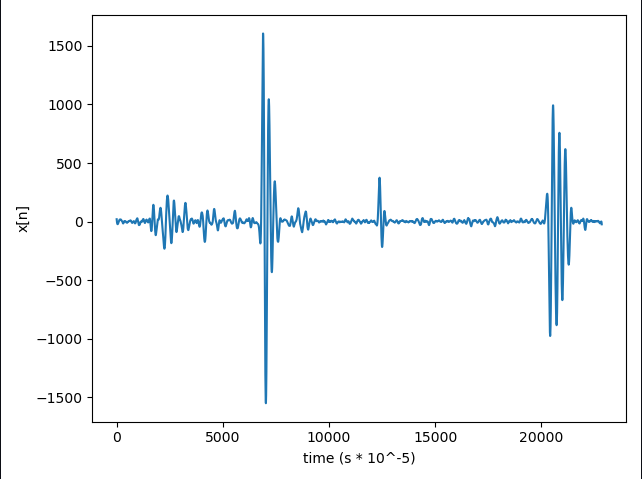
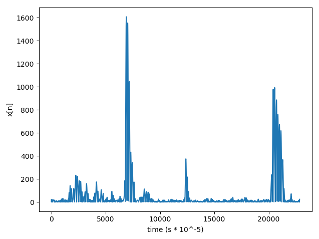
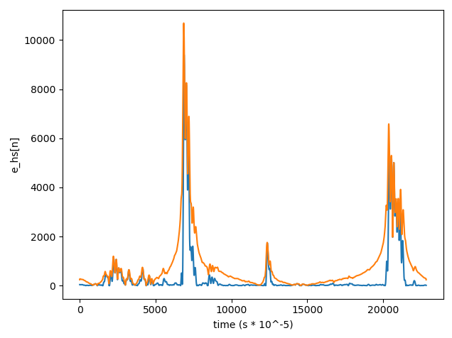
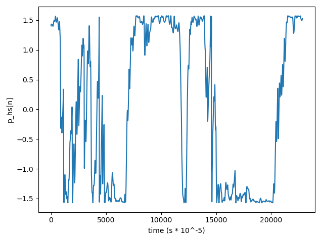
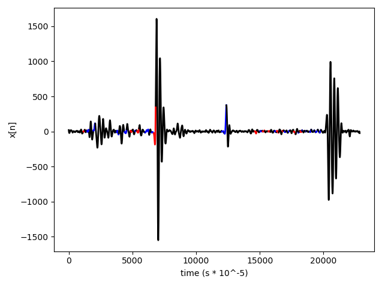

# PCG_analysis
This repository is for collection and analysis of Phonocardiogram signals as outlined by V. NIVITHA VARGHEES in her thesis 
"PHONOCARDIOGRAM SIGNAL DELINEATION METHODS FOR AUTOMATED ANALYSIS OF HEART SOUNDS AND MURMURS" for AMRITA SCHOOL OF ENGINEERING in 
July 2017. Specifically, this repo tries to implement some of the methods detailed in the thesis' 5th chapter. 

The PCG signals used in this analysis can be found [here](http://www.peterjbentley.com/heartchallenge/)

Above is the image of a PCG signal exhibiting, in order of time: first an s4 signal followed quickly by s1, a small interference and then s2. 

Above is the image of the absolte values of the initial PCG wave

Above we can see the shannon energy envelope and the absolute of the hilbert transform of the absolute PCG signal

Above is the image of the instantaneous phase of the hilbert transform over time. Its amplitude ranges from -1.57 to +1.57 radians. 

Above we can see the color mapped PCG signal with red regions denoting s1, blue regions denoting s2, and black regions denoting all other 
ranges. As is evident, the classification isn't nearly as good as it could have been. This is due to the fact that the phase waveform is distorted. 

A smoother, more defined phase signal would have lead to the correct classification, as per the method outlined in the thesis. A few reasons this doesn't happen is due to the differences in filtering methods used, and the non-inclusion of the adaptive noise level threshold in the classification code implemented here. 
